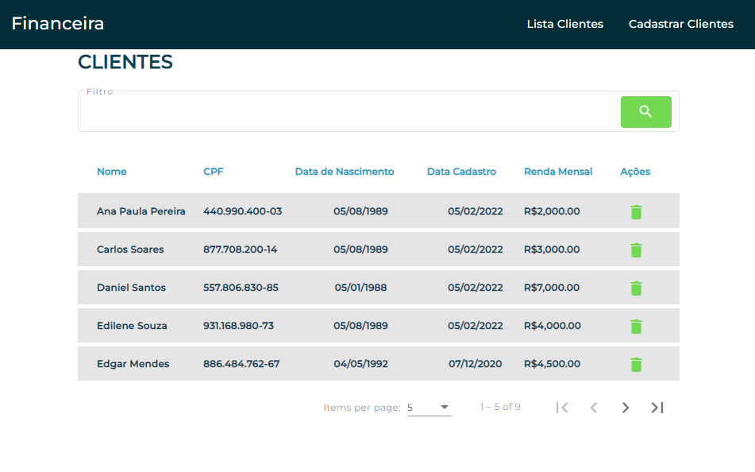
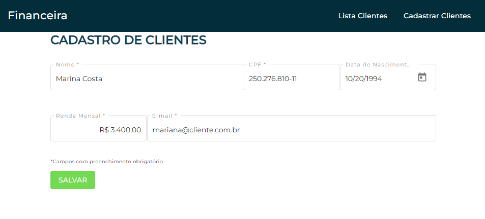

# FinancialCustomer

Projeto de exemplo feito em Angular 14 + JSON Server

Veja o código no editor online: https://github1s.com/moraisandre/financial-customer

## Como rodar?

Executar os seguintes comandos:
* ng serve
* npm run json:server

## Versões

* Angular: 14.0.6
* Node: v18.6.0
* Npm: 8.14.0

## Capturas de Tela

### Tela Consulta de Clientes

### Tela Criação de Clientes
